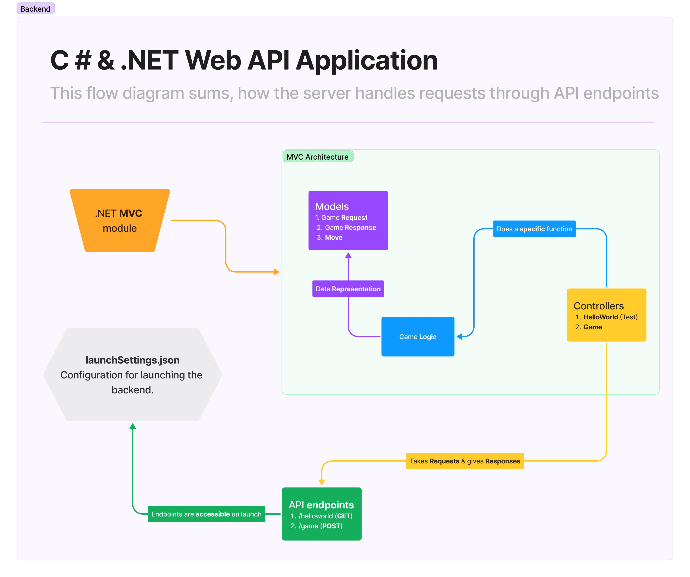
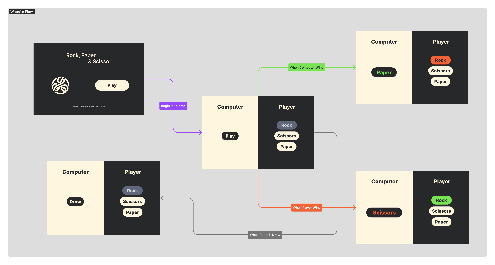
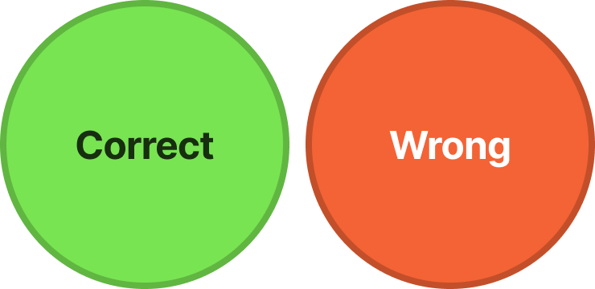

<h1 align="center">Assignment - 1 (C# & .Net)</h1>

**Problen Statement** $\to$ A `C#` & `.NET` web **API** application, that is used to play a game of Rock-Paper-Scissors. Static `HTML` pages are used to interact with the API.

## Project

The project is website that is used to play a game of Rock-Paper-Scissors. The project is divided into two parts:

1. Backend
2. Frontend

### Backend

The backend is a `C#` & `.NET` web **API** application, that is used to play a game of Rock-Paper-Scissors. The API has the following endpoints:

1. **GET** `/helloworld` - Returns a simple string response to test if the server is running.
2. **POST** `/game` - *Accepts* a JSON object with the **player's move** and *returns* the **result** of the game.

The architecture is based **MVC** (Model-View-Controller) pattern. The `GameController` is the controller that handles the requests and responses of the game.

> For faster development and testing, a layer abstraction is created between model and game logic. The `GameLogic()` class is the model that contains the game logic. The `GameController` uses the `GameLogic()` class to play the game.
`
### Frontend

The frontend is a static `HTML` page that is used to interact with the API. The frontend is hosted on [GitHub Pages](https://r21ef257.github.io/csharp-assignment-1/). The frontend has the following pages:

1. `index.html` - The landing page of the website.
2. `game.html` - The page where the game is played.

In `game.html`, uses `/game` endpoint to play the game with the computer logic. The page has the following features:

1. **Player's Move** - The player can select their move from the three options: Rock, Paper, Scissors.
2. **Computer's Move** - Click on **Play** Button.

The result of the game is displayed by colors on the button with these colors:

